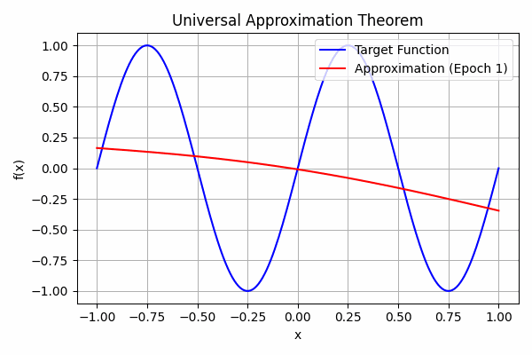
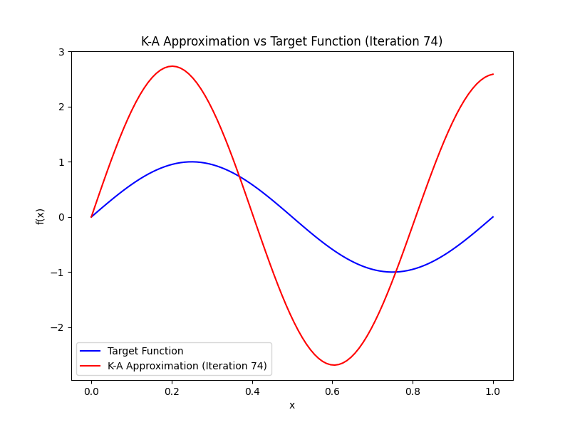
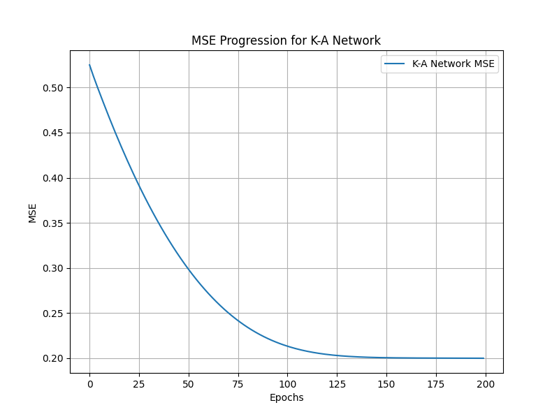

# Universal Approximation Theorem Visualization

This project visualizes the **Universal Approximation Theorem (UAT)** using a simple neural network with one hidden layer. The network approximates a continuous function \( f(x) = \sin(2\pi x) \), and its progress is captured over training epochs to demonstrate how it converges.

---

## 🧠 Overview

The Universal Approximation Theorem states that a feedforward neural network with a single hidden layer containing a sufficient number of neurons can approximate any continuous function on a compact subset of \( \mathbb{R}^n \).

In this project, we:
1. Generate a dataset for a target function.
2. Build a neural network with one hidden layer.
3. Train the network while visualizing its approximation over time.
4. Combine visualizations into a GIF.

---

## 🚀 Getting Started

### Prerequisites
- Python 3.7+
- Install dependencies:
  ```bash
  pip install -r requirements.txt
  ```


## **Repository Structure**
```plaintext
universal-approximation-UAT-visualization/
│
├── data/                                    # datasets
├── src/                                     # Codebase (python scripts)
│   ├── generate_dataset.py                  # Generates target function data
│   ├── build_model.py                       # Defines the neural network architecture
│   ├── train_and_visualize.py               # Training loop and frame generation
│   ├── create_gif.py                        # Combines frames into a GIF
│   ├── K-A-vs-NN/                           # New subfolder for Kolmogorov-Arnold vs NN representation
│   │   ├── ka_representation.py             # K-A approximation script
│   │   ├── nn-representation.py             # NN approximation script (MLP model)
        ├── ka-net-create-animation.py       # script for K-A approx. (200 epochs) to then compare it with NN's
        └── ka-net-vs-nn-mse_comparison-create_gif.py # script to generate graphs for ka repr to approximate f with n control points
│
├── assets/                                  # Saved artifacts for the README
│   └── example.gif                          # Example GIF for visualization
│
├── .gitignore                               # Ignoring unnecessary files
├── LICENSE                                  # Repository license (MIT)
├── README.md                                # Detailed project documentation
├── requirements.txt                         # List of Python dependencies
└── universal_approximation.py               # Aggregated script (all-in-one)
```


Usage
Generate the dataset:

```bash

python src/generate_dataset.py
```


Train and visualize:

```bash

python src/train_and_visualize.py
```


Create the GIF:

```bash

python src/create_gif.py
```


>> 🖼️ Output

The training process is visualized as a GIF:



# Steps to make and update this repository

1. **Initialize the Repository**

  Start with git init and set up a clean directory structure as shown above.


2. **Incremental Commits Plan**

  Commit 1: Add generate_dataset.py to create the dataset for f(x).
  - ...


# 🛠️ Extensions
  This repository will soon include:

  - [x] 1. Kolmogorov–Arnold representation.
  - [x] 2. Approximation using B-Splines.
  - [ ] 3. Comparisons of traditional(NN/MLP) vs modern methods (K-A theorem/representation).

  - Example of current output for the K-A scripts:
  
  > 
  >> 
  >>> 

  - [ ] 4. Improving the current K-A approximation with more trainable control points and parameters
  - [ ] 5. Benchmarking K-A vs MLP/NN especially for deep multi-layer nets
  - 6. ...

    
## 📜 License
  This project is licensed under the MIT License.

